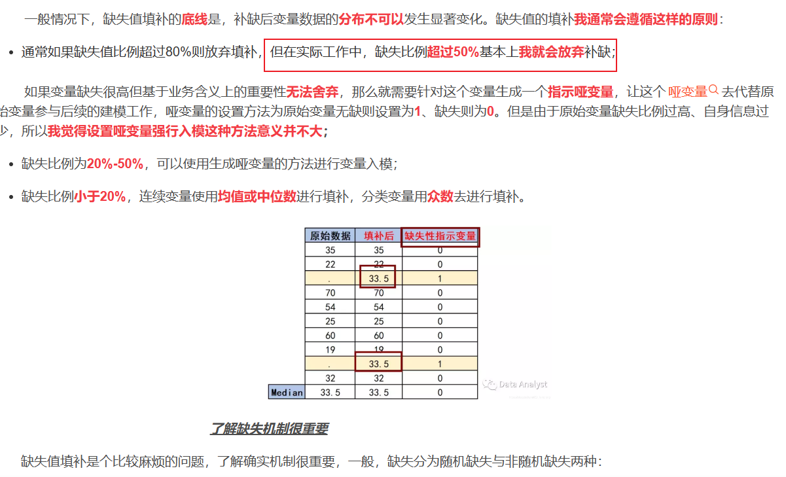

### 步骤
https://zhuanlan.zhihu.com/p/416295507
https://cloud.tencent.com/developer/article/2435845
1. 查看数据分布情况,是否存在样本不平衡
2. 可视化不同变量
3. 查看不同特征之间的相关性，剔除相关性强的冗余特征
4. feature crossing,数值性特征进行加减乘除，离散性特征进行合并
5. 特征重要因子

#### 重要参数

- 基本参数调整

    (a) num_leaves参数 这是控制树模型复杂度的主要参数，一般的我们会使num_leaves小于（2的max_depth次方），以防止过拟合。由于LightGBM是leaf-wise建树与XGBoost的depth-wise建树方法不同，num_leaves比depth有更大的作用。

    (b) min_data_in_leaf 这是处理过拟合问题中一个非常重要的参数. 它的值取决于训练数据的样本个树和 num_leaves参数. 将其设置的较大可以避免生成一个过深的树, 但有可能导致欠拟合. 实际应用中, 对于大数据集, 设置其为几百或几千就足够了.best gain -inf的原因是the learning of tree in current iteration should be stop,due to cannot split any more.

    (c) max_depth 树的深度，depth 的概念在 leaf-wise 树中并没有多大作用, 因为并不存在一个从 leaves 到 depth 的合理映射。
- 针对训练速度的参数调整
    (a) 通过设置 bagging_fraction 和 bagging_freq 参数来使用 bagging 方法。

    (b) 通过设置 feature_fraction 参数来使用特征的子抽样。

    (c) 选择较小的 max_bin 参数。

    (d) 使用 save_binary 在未来的学习过程对数据加载进行加速。

- 针对准确率的参数调整

    (a) 使用较大的 max_bin （学习速度可能变慢）

    (b) 使用较小的 learning_rate 和较大的 num_iterations

    (c) 使用较大的 num_leaves （可能导致过拟合）

    (d) 使用更大的训练数据

    (e) 尝试 dart 模式

- 针对过拟合的参数调整
    (a) 使用较小的 max_bin

    (b) 使用较小的 num_leaves
    
    (c) 使用 min_data_in_leaf 和 min_sum_hessian_in_leaf

    (d) 通过设置 bagging_fraction 和 bagging_freq 来使用 bagging

    (e) 通过设置 feature_fraction 来使用特征子抽样

    (f) 使用更大的训练数据

    (g) 使用 lambda_l1, lambda_l2 和 min_gain_to_split 来使用正则
    
    (h) 尝试 max_depth 来避免生成过深的树

- TODO
1. 统计正负样本的数量。
2. 统计每个特征的饱和度，低于30%考虑丢弃，如果是比较重要的因子需要让标签组补充。
3. 统计每个特征的数值分布，如果某个特征的取值范围不存在明显差距，考虑丢弃，无法学习到规律。
4. 统计各个特征之间的相关性热力图，考虑剔除那些相关性较强的冗余特征。
5. 考虑feature crossing,看看特征之间是否可以进行两两组合。
6. 

- 使用IQR过滤异常值
1. 根据IQR规则，异常值通常定义低于Q1 - 1.5*IQR,或高于Q3+1.5*IQR

- 业界广泛流传这样一句话：数据和特征决定了机器学习的上限，而模型和算法只是逼近这个上限而已。

1. 却是值填补的底线是，补缺后变量数据的分布不可以发生显着变化。

https://medium.com/@andrywmarques/how-lgbm-deals-with-missing-values-bd361636357f

- Categorical features can be discretized using one hot encoding and continuous variables can be discretized using binning technique. 
- 更加复杂的模型，比如神经网络，自己就能够习得特征交叉；在线性模型中，需要我们显式地使用这个模式
- 机器学习设计模式#4：特征交叉（Feature Cross） https://zhuanlan.zhihu.com/p/687131263