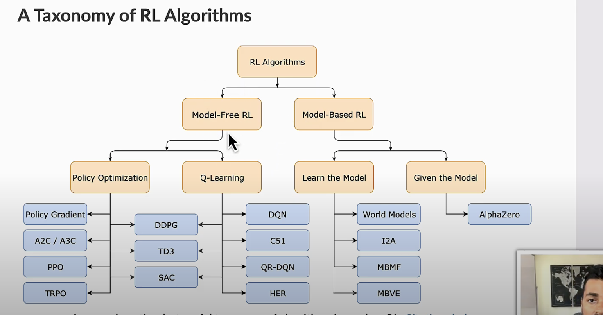
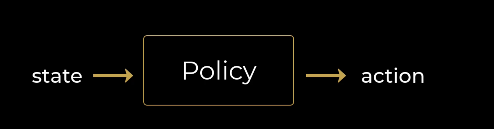
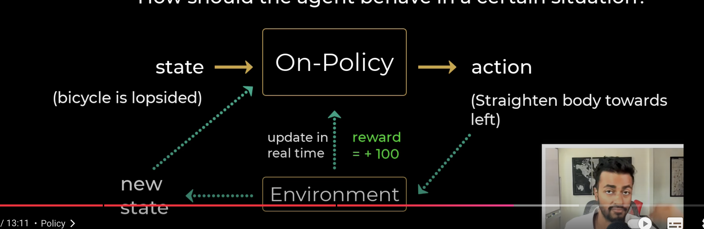
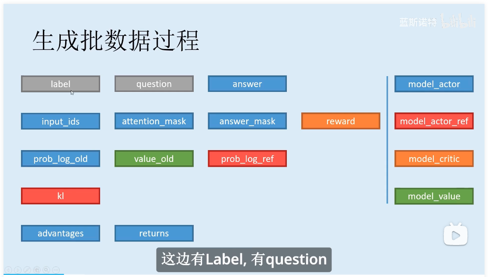
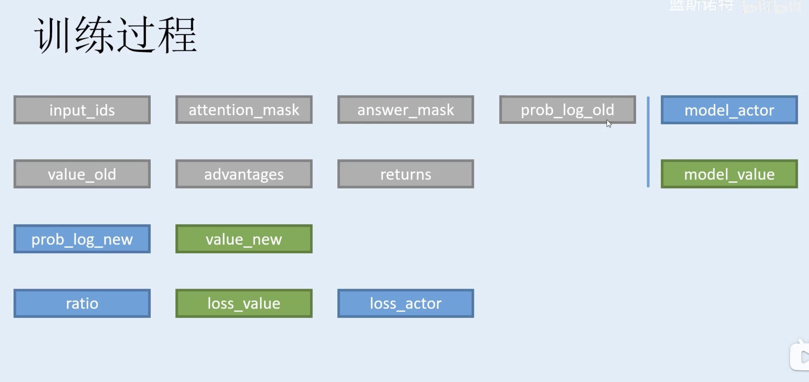

### A Taxonomy of RL Algorithms


### Reinforementt Learning
- State
- Action
- Reward
- Agent
- Environment


### policy 
1. Control how should the agent behave in a certain situation


2. On Policy vs Off Policy
- On policy基于自己的过往行为进行state的更新

- Off Policy是基于别人的行为，说大白话就是一堆数据让你训练和学习，而```不是实时地基于自己过往的行为去更新自己当前的行为```
- PPO(Proximal Policy Optimization)是属于Off Policy的一种。


### RLHF在大语言模型中的应用
#### 生成过程

#### 训练过程

1. Actor Model
- 该模型就是sft出来的模型，要拿来进行强化学习训练。

2. Reference Model
- 完全的 sft 模型的copy,用于Actor Model在进行训练的过程中，让模型不要偏差和Actor模型偏差过大，使用 KL散度去进行约束。

3. Reward Model
- 奖励模型，用于评估 sft 模型产生的答案是好还是坏，是从句子层面进行score计算的，并把Reward加入到 Loss的训练中。

4. Value Model
- 从token层面计算对每个字进行打分。

5. 需要训练的模型
- Actor Model和 Value Model
- 该actor model为sft的大语言模型, value model为每个token进行打分。
- **ratio**是指新旧概率(prob_log_old vs prob_log_new)的比率。
- 在NLP的语境下,

        - “收益”的含义是“对人类喜好的衡量”
        - Rt:即时收益，指语言模型当下产生token 带来的收益
        - Vt：实际期望总收益（即时+未来），指对语言模型“当下产生token ，一直到整个response生产结束”后的期收益预估。因为当下语言模型还没产出后的token，所以我们只是对它之后一系列动作的收益做了估计，因而称为“期望总收益”。

6. PPO
- advantags和returns是PPO所特有的。类似于强化学习的Q函数。

### PPO(Promixl Policy Optimization)
- 
