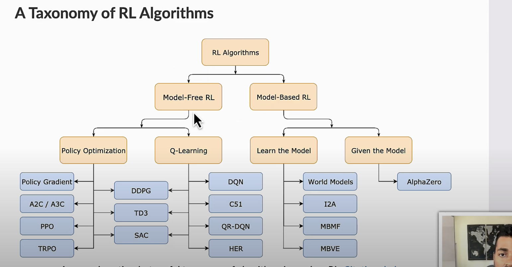

### A Taxonomy of RL Algorithms


### Reinforementt Learning
- State
- Action
- Reward
- Agent
- Environment


### policy 
1. Control how should the agent behave in a certain situation


2. On Policy vs Off Policy
- On policy基于自己的过往行为进行state的更新

- Off Policy是基于别人的行为，说大白话就是一堆数据让你训练和学习，而```不是实时地基于自己过往的行为去更新自己当前的行为```
- PPO(Proximal Policy Optimization)是属于Off Policy的一种。

### PPO(Promixl Policy Optimization)
- 